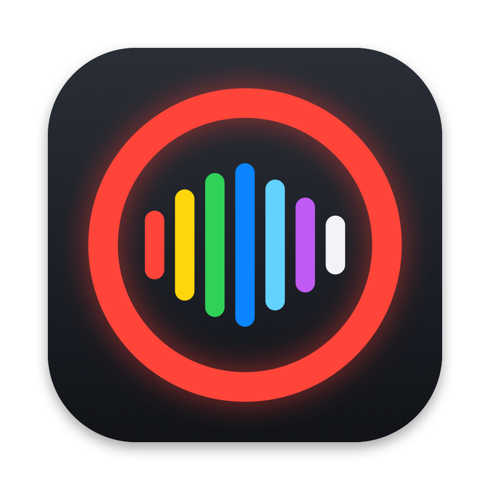

<p align="center"></p>

# ShowRecorder

Record every channel of your mixer from an iPhone or iPad, or the Mac you already have.

You don't need a dedicated recording laptop. Plug a multichannel USB mixer or audio interface into a USB-C iPhone through a powered hub, or into the Mac mini in your rack or the MacBook at front of house, tap record, and you get a Show folder with one stem per channel. On mixers ShowRecorder knows how to talk to, each track is also named and colored from the mixer itself, so channel 7 arrives as `07 Lead Vocal.wav`, not `Input 7`. Behringer X-Air (XR18) and Midas MR18 are supported first; more mixers will follow.

> **Status: in development.** It isn't on the App Store yet. The recording core works and is tested; the remaining MVP work is tracked in [issue #1](https://github.com/ericdahl-dev/ShowRecorder/issues/1) and the issues linked from it.

## What works today

- **Multitrack recording:**
  - One mono 24-bit, 48 kHz Broadcast WAV Stem per USB Channel, in `Show / Take NN / Stems` folders.
  - Each Stem's bext chunk carries its Source name and a time reference shared by every Stem in the Take.
- **Crash-safe files:** headers are committed every 2 seconds, so if the app is killed or loses power, the Stems still play up to the last commit. Stems switch to RF64 before they pass 4 GB.
- **Any multichannel USB input:** every channel the device sends is recorded, with no fixed channel count.
- **Mixer Link over Wi-Fi** (X-Air mixers today):
  - Enter the mixer's IP and each meter shows its Source's name and color.
  - Names are frozen into the Stems and `Take.json` when record is pressed.
  - Mute, fader and input source are saved with each Take when the mixer reports them.
- **After the show:**
  - Each Show gets an HTML report and a CSV channel list.
  - Each Show gets a Reaper project with one track per USB Channel, Takes laid end to end and a marker at each Take.
- **Mac and iOS input:**
  - On the Mac, any Core Audio device, with hot-plug: plug in a mixer and it's armed.
  - On iPhone and iPad, the current USB route.
  - Recording continues with the screen locked, in the background and through interruptions.

Not built yet: writing to the SSD and the phone at the same time, Gaps and Repair, pre-roll, markers, Templates, Mixer Triggers, the Show list and sharing. See the [open issues](https://github.com/ericdahl-dev/ShowRecorder/issues).

## The rig

| Part | Notes |
|---|---|
| A multichannel USB mixer or audio interface | Class-compliant over USB, so iOS and macOS see it without a driver. Every channel it sends is recorded. |
| USB-C iPhone (15 or later) or iPad, or any Mac | iOS/iPadOS/macOS 26. |
| Powered USB-C hub | Charges the phone while the mixer and the SSD are connected. |
| SSD | Optional until the two-destination slice lands. About 0.5 GB per channel per hour at 48 kHz/24-bit (about 9.3 GB per hour for 18 channels). |
| The mixer's network | Optional, for channel names and colors on supported mixers. |

### Mixer integration

| Mixer | Recording | Names and colors |
|---|---|---|
| Behringer XR18, Midas MR18 | 18 USB Channels | Yes, over Wi-Fi (USB coming) |
| Behringer XR12/XR16 | No multichannel USB | n/a |
| Behringer X32/M32 (X-USB card) | Should work as a USB interface (untested) | Planned |
| Other class-compliant mixers and interfaces | Should work (untested) | Not yet |

A list of tested hubs and SSDs will follow the first hardware check ([#4](https://github.com/ericdahl-dev/ShowRecorder/issues/4)).

## The Show-Safe Promise

A Take never stops, and audio is never held back, because of a trial, a limit or a license. Limits are checked only when record is pressed. See [ADR 0004](docs/adr/0004-one-time-pro-unlock-and-show-safe-limits.md).

## Building

Requirements: Xcode 26 and [XcodeGen](https://github.com/yonaskolb/XcodeGen) (only needed if you change `project.yml`).

```sh
# Domain logic and tests, no hardware needed
cd Packages/ShowRecorderKit
swift test

# The app (the generated Xcode project is committed)
open ShowRecorder.xcodeproj
```

To build from the command line without a signing team:

```sh
xcodebuild -project ShowRecorder.xcodeproj -scheme ShowRecorder \
  -destination 'platform=macOS' \
  CODE_SIGN_IDENTITY=- CODE_SIGN_STYLE=Manual DEVELOPMENT_TEAM= build
```

To run on a device, pick your own team in Xcode. After editing `project.yml`, run `xcodegen generate` and commit both files.

Debug builds include an 18-channel **Demo signal** input, so the record screen works in the simulator without hardware.

## How the code is laid out

```
App/                         SwiftUI app (iOS, iPadOS, macOS), a thin layer
Packages/ShowRecorderKit/
  AudioIO                    The audio I/O boundary and a fake device for tests
  CoreAudioIO                Mac input (AUHAL) and iOS input (AVAudioSession + RemoteIO)
  Recording                  The Recorder: Armed state, meters, the real-time ring buffer,
                             writer thread, Shows, Takes, Take.json
  BroadcastWave              Stem writer (BWF, crash-safe headers, RF64)
  OSC                        Open Sound Control encoding and decoding
  MixerLink                  Mixer drivers (X-Air over UDP 10024) and the Mixer Link
  ShowReport                 Per-Show HTML report and CSV
  ProjectExport              DAW project export (Reaper first)
```

The audio callback never allocates, takes locks, logs or touches the file system ([ADR 0002](docs/adr/0002-swift-real-time-audio-path.md)). Most tests drive a full recording session with a fake audio device and a fake X-Air mixer on a loopback UDP port, then check the files on disk.

## Artwork

`design/render-artwork.swift` draws the app icon (iOS and Mac) and the 1280×640 social preview with Core Graphics: `swift design/render-artwork.swift design`. Copy the icons into `App/Assets.xcassets/AppIcon.appiconset` after changing them.

## Documentation

- [`CONTEXT.md`](CONTEXT.md): the project's vocabulary (Show, Take, Stem, USB Channel, Source, Mixer Link…). Code, issues and UI copy use these terms.
- [`docs/adr/`](docs/adr): architecture decisions.
- [Issue #1](https://github.com/ericdahl-dev/ShowRecorder/issues/1): the product requirements and user stories.

## License

Source-available under the [Functional Source License, Version 1.1, MIT Future License](LICENSE.md) (FSL-1.1-MIT). You can read, change and use the code for anything except a competing product. Each release becomes MIT two years after it's published. See [ADR 0003](docs/adr/0003-fsl-license-app-store.md).

Contributions are welcome. Because the app ships on the App Store, outside contributions will need a contributor agreement; open an issue before starting anything large.

Copyright 2026 Eric Dahl.
